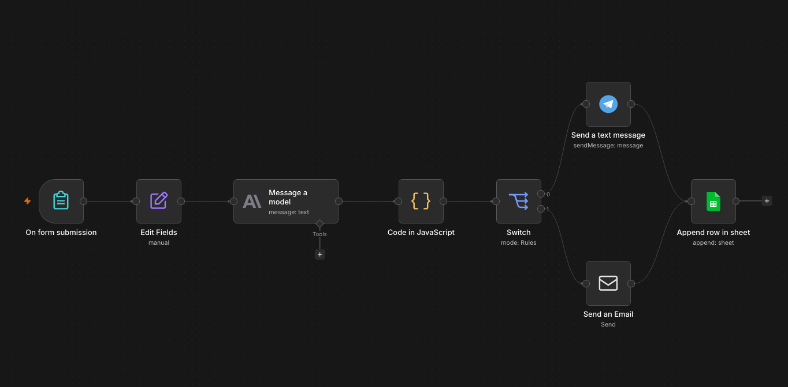
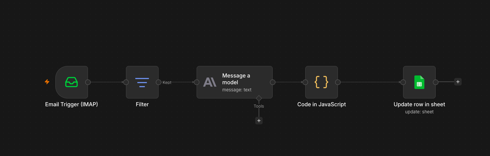
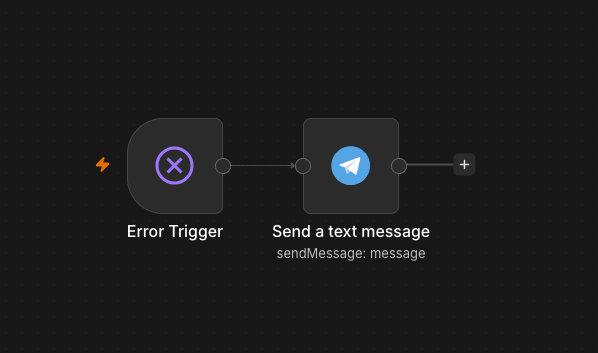
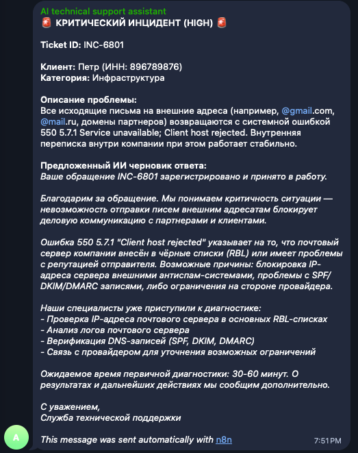
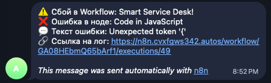

# 🤖 Smart Service Desk & AI Triage Workflow (n8n + Claude API)

Сквозная событийно-ориентированная система (Event-Driven Architecture) для автоматизации обработки B2B-обращений, приёма заявок, классификации инцидентов с помощью ИИ-агентов и умной маршрутизации.

---

## 💡 Проблема бизнеса и решение
**Боль:** 1-я линия технической поддержки и менеджеры тратят до 70% рабочего времени на ручную сортировку хаотичных обращений, отсечение спама, пересылку тикетов профильным специалистам и написание типовых ответов. Критические инциденты теряются в общем потоке, нарушая SLA.

**Решение:** Автономный конвейер на базе **n8n** и **Claude API (Anthropic)**, который перехватывает обращения в реальном времени, классифицирует их по критичности с помощью LLM, мгновенно эскалирует аварии в Telegram инженерам и автоматически закрывает простые запросы или генерирует черновики ответов.

---

## 🛠 Архитектура решения (3 независимых контура)

Проект спроектирован по паттерну Event-Driven Architecture: вместо одного громоздкого сценария логика разделена на 3 изолированных асинхронных потока.

### 1. Контур приёма заявок и первичного триажа
Отвечает за приём обращений (Webhook / Form), генерацию ID (`INC-XXXX`), распознавание интента через Claude API и маршрутизацию (Switch Node). Тикеты `High` отправляют мгновенный алерт в Telegram, `Medium/Low` — email клиенту.

### 2. Контур обработки обратной связи и защиты от спама
Работает через независимый `IMAP Trigger`. Мониторит почту, отсекает спам через Filter Node (проверяет маркер `INC-`), очищает JSON от Markdown-разметки с помощью custom JS Code Node и обновляет статусы в Google Sheets по логике Upsert (без дубликатов).

### 3. Контур отказоустойчивости и мониторинга
Независимый `Error Trigger` перехватывает ошибки и таймауты в любых нодах процесса, отправляя администратору детальный лог сбоя. Реализована методология **Human-in-the-Loop** (ИИ не отправляет ответы на критические аварии без одобрения человека).

---

## 📱 Демонстрация работы (Алерты и уведомления)

Мгновенные уведомления в Telegram позволяют техподдержке реагировать на инциденты за секунды, имея перед глазами готовую аналитику от ИИ и черновик ответа:

| 🚨 Срочный алерт инцидента (High Priority) | ⚠️ Уведомление о статусе / Сбой (Error Log) |
| :---: | :---: |
|  |  |
*Примеры автоматических сообщений, сгенерированных и отправленных системой в Telegram-канал 1-й линии поддержки.*

---

## 🚀 Ключевые технологии и интеграции
* **Оркестрация:** n8n (Docker / Self-hosted Linux VPS + SSL/HTTPS)
* **ИИ / LLM:** Anthropic Claude 3.5 Sonnet API (Промпт-инжиниринг, JSON-mode, Intent Recognition)
* **Интеграции:** REST API, Webhooks, IMAP, Telegram Bot API, Google Sheets API (Upsert)
* **Код и парсинг:** JavaScript (ES6+), JSON, регулярные выражения (RegEx)

---

## 📦 Как развернуть проект у себя
1. Скачайте файл `smart_service_desk_workflow.json` из этого репозитория.
2. В вашем интерфейсе n8n перейдите в меню `...` -> **Import from File** и выберите скачанный файл.
3. Настройте свои учетные данные (Credentials):
   * **Anthropic API Key** (для ноды Claude)
   * **Telegram Bot Token & Chat ID** (для отправки уведомлений)
   * **Google Account** (для связи с таблицей)
   * **IMAP / SMTP** (для чтения и отправки почты)
4. Активируйте переключатель **Active** в верхнем правом углу — ваш конвейер готов к работе!

---

## 📊 Результаты внедрения (Метрики эффективности)
* **Снижение MTTR (Mean Time To Respond):** время первой реакции на критический сбой сократилось с 15 минут до 5 секунд.
* **Экономия ресурса команды:** ручная рутина 1-й линии поддержки сокращена на 65-70%.
* **Нулевой риск дубликатов:** благодаря логике Upsert все коммуникации по одному инциденту строго привязаны к единой строке в базе данных.
